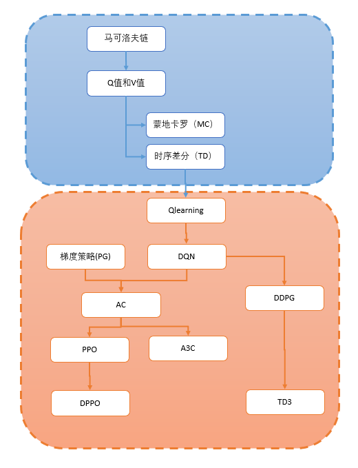

### 白话强化学习

愿成为一把梯子，助你跨过无数的坑。——初心

当前，人工智能可以说是大热的学科。强化学习这个分支更是备受瞩目。至于强化学习什么征服Atari，围棋，德扑之类这些就不吹了。你应该知道自己为什么要学reinforcment learning。

但在入门的时候，却感觉非常困难！

以个人爬坑的经验，主要有三点：

1. 人工智能背靠数学。但绝大部分人，在高考之后，数学能力就直线下降。一生都被数学的恐惧所支配。这无疑令想入门人工智能的人望而却步。学习了大半年贝叶斯和博弈论，但还是进入不了人工智能的大门。其实在人工智能领域，很多时候更讲求“直觉”。人工智能科学家的算力远不如计算机，但为什么能设计出这些优秀的模型呢？除了数学，主要还是直觉。我希望这系列文章，能先帮助大家“绕”过数学，进入人工智能的大门。当我们进入大门，能够用代码实现一些算法，再深究算法中的数学，那时候必定更容易理解，更有动力学习其数学原理。

2. 代码能力。这里先给大家吃颗定心丸。在强化学习试验，代码一般比较简单的。很多人工智能的代码已经集成成工具给大家直接调用。在这个系列文章，每种强化学习的算法我会用tensorflow2.0的官方示例加上我自己的代码详细讲解，并提供我自己的注释版本。让你一边学习，一边提高代码能力。

3. 学习线路。强化学习作为人工智能的一个分支，网上已经有很多学习资料。但翻开资料，每位老师说的方式和侧重点都不太一样。我希望在这系列文章中，给大家指出一条线路。让大家能够快速入门。大家将会在这系列文章学到：TD、MC、Qlearning、DQN、DQN的变种、PG、AC、A3C、SAC、PPO、DPPO等系列算法的实现。这系列文章将会少用数学，多做代码解释。希望能帮助大家快速掌握强化学习知识。快速入门。

希望我的努力能够帮助大家较少入门的负担。

综述：

欢迎大家入坑Reinforcment Learning
https://zhuanlan.zhihu.com/p/111869532

目录
第一部分——概念：

怎样正确理解马尔科夫链？
https://zhuanlan.zhihu.com/p/109217883

如何理解强化学习中的Q值和V值？
https://zhuanlan.zhihu.com/p/109498587

如何用蒙地卡罗方法（Monte-Carlo）估算V值？
https://zhuanlan.zhihu.com/p/109755443

[番外]蒙地卡罗MC的更新公式怎么来的？
https://zhuanlan.zhihu.com/p/110118392

如何用时序差分TD估算状态V值？
https://zhuanlan.zhihu.com/p/110132710

第二部分——核心算法：

[番外]如何从师生关系理解环境与智能体的互动？
https://zhuanlan.zhihu.com/p/110155777

[理论篇]怎样直观理解Qlearning算法？
https://zhuanlan.zhihu.com/p/110338833

手把手教你实现Qlearning算法[实战篇]
https://zhuanlan.zhihu.com/p/110410276

一篇文章带你了解深度神经网络
https://zhuanlan.zhihu.com/p/110531783

三维可视化助你直观理解DQN算法[DQN理论篇]
https://zhuanlan.zhihu.com/p/110620815

用可视化直观理解DQN[DQN实战篇]
https://zhuanlan.zhihu.com/p/110657606

Double DQN原理是什么，怎样实现？（附代码）
https://zhuanlan.zhihu.com/p/110769361

[番外篇]DuelingDQN为何那么强？(附代码)
https://zhuanlan.zhihu.com/p/110807201

如何理解策略梯度（Policy Gradient）算法？[附代码]
https://zhuanlan.zhihu.com/p/110881517

理解Actor-Critic的关键是什么？
https://zhuanlan.zhihu.com/p/110998399

小段文讲清argparse模块基本用法[小番外]
https://zhuanlan.zhihu.com/p/111010774

如何直观理解PPO算法?[理论篇]
https://zhuanlan.zhihu.com/p/111049450

如何直观理解PPO算法[实战篇]
https://zhuanlan.zhihu.com/p/111068310

一文带你理清DDPG算法
https://zhuanlan.zhihu.com/p/111257402

什么是TD3算法？
https://zhuanlan.zhihu.com/p/111334500

AC：看我的影分身之术[A3C]
https://zhuanlan.zhihu.com/p/111336330

PPO:看我的影分身之术[DPPO]
https://zhuanlan.zhihu.com/p/111346592

